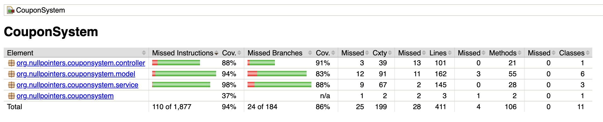
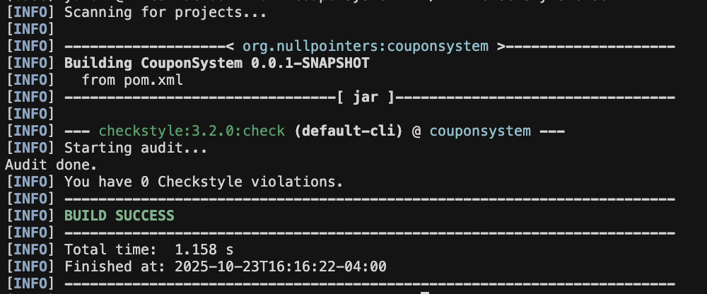

# Coupon Management System

A centralized coupon management system built with Spring Boot that allows stores to define and manage various types of coupons, and provides intelligent coupon recommendation and cart optimization features.

**Team:** Null Pointers

## Table of Contents

- [Features](#features)
- [System Architecture](#system-architecture)
- [Technologies Used](#technologies-used)
- [Prerequisites](#prerequisites)
- [Building the Project](#building-the-project)
- [Running the Application](#running-the-application)
- [Running Tests](#running-tests)
- [API Documentation](#api-documentation)
  - [Store Endpoints](#store-endpoints)
  - [Item Endpoints](#item-endpoints)
  - [Coupon Endpoints](#coupon-endpoints)
  - [Core Functionality Endpoints](#core-functionality-endpoints)
- [Client Application](#client-application)
  - [What the Client Does](#what-the-client-does)
  - [Building and Running the Client](#building-and-running-the-client)
  - [Multi-Client Support](#multi-client-support)
- [End-to-End Testing](#end-to-end-testing)
  - [Automated End-to-End Tests](#automated-end-to-end-tests)
  - [Manual Testing Checklist](#manual-testing-checklist)
- [Error Codes](#error-codes)
- [Usage Examples](#usage-examples)
- [Project Structure](#project-structure)
- [Third-Party Dependencies](#third-party-dependencies)
- [AI Tools Usage](#ai-tools-usage)

## Features

### Data Models

- **Store**: Represents retail stores with unique IDs and names
- **Item**: Products available for purchase with name, price, store association, and category
- **Coupons**: Three types of discount coupons:
  - **TotalPriceCoupon**: Discount when cart total exceeds a threshold
  - **CategoryCoupon**: Discount on specific category items
  - **ItemCoupon**: Discount on a specific item

### Core Functionalities

1. **Optimal Coupon Selection**: Given a cart of items and store, identifies the coupon that provides maximum discount
2. **Store Recommendations**: Given an item keyword or category, returns optimal stores sorted by best price (including applicable coupons)
3. **Cart Optimization**: Given a cart and a TotalPriceCoupon, suggests cheapest items to add to meet the coupon threshold

### Additional Features

- Full CRUD operations for stores, items, and coupons
- Search items by keyword or category
- Filter items and coupons by store
- In-memory data storage for easy testing

## System Architecture

The application follows a layered architecture:

- **Controller Layer** (`RouteController`): REST API endpoints
- **Service Layer** (`CouponService`, `DataService`): Business logic
- **Model Layer**: Data entities (Item, Store, Coupon types)

All components are loosely coupled using dependency injection via Spring Boot.

## Technologies Used

- **Java**: 17
- **Framework**: Spring Boot 3.4.4
- **Build Tool**: Maven
- **Testing**: JUnit 5, Mockito
- **Code Coverage**: JaCoCo
- **Style Checker**: CheckStyle (Google Style)
- **Static Analysis**: PMD
- **Version Control**: Git/GitHub

## Prerequisites

- Java Development Kit (JDK) 17 or higher
- Maven 3.6+ (or use the included Maven Wrapper)
- Git (for version control)

## Building the Project

### Using Maven Wrapper (Recommended)

**Note**: If you encounter a "Permission denied" error on Unix/macOS, you may need to make the Maven wrapper executable first:
```bash
cd CouponSystem
chmod +x mvnw
```

On Unix/macOS:
```bash
cd CouponSystem
./mvnw clean install
```

On Windows:
```cmd
cd CouponSystem
mvnw.cmd clean install
```

### Using System Maven

```bash
cd CouponSystem
mvn clean install
```

This will compile the code, run all tests, generate test coverage reports, and perform style checking and static analysis.

## Running the Application

**Note**: If you get a "Permission denied" error, see the [Building the Project](#building-the-project) section for instructions on making `mvnw` executable.

### Using Maven

```bash
cd CouponSystem
./mvnw spring-boot:run
```

### Using Java

```bash
cd CouponSystem
./mvnw clean package
java -jar target/couponsystem-0.0.1-SNAPSHOT.jar
```

The application will start on `http://localhost:8080`

## Running Tests

**Note**: If you get a "Permission denied" error, see the [Building the Project](#building-the-project) section for instructions on making `mvnw` executable.

### Run All Tests

```bash
cd CouponSystem
./mvnw test
```

### Run Tests with Coverage Report

```bash
cd CouponSystem
./mvnw clean test jacoco:report
```

Coverage reports will be generated in `target/site/jacoco/index.html`

#### Most Recent Test Coverage Results



### Run Style Checks

```bash
cd CouponSystem
./mvnw checkstyle:check
```

#### Most Recent Checkstyle Results



### Run Static Analysis

```bash
cd CouponSystem
./mvnw pmd:check
```

## API Documentation

All endpoints return JSON responses unless otherwise specified.

### Store Endpoints

#### Create Store
- **Endpoint**: `POST /store`
- **Request Body**:
  ```json
  {
    "name": "Tech Store"
  }
  ```
- **Success Response**: 
  - **Code**: 201 CREATED
  - **Body**: Created Store object with assigned ID
- **Error Response**:
  - **Code**: 400 BAD REQUEST
  - **Body**: Error message string

#### Get Store
- **Endpoint**: `GET /store/{id}`
- **URL Parameters**: `id` (integer) - Store ID
- **Success Response**: 
  - **Code**: 200 OK
  - **Body**: Store object
- **Error Response**:
  - **Code**: 404 NOT FOUND
  - **Body**: "Store not found."

#### Get All Stores
- **Endpoint**: `GET /stores`
- **Success Response**: 
  - **Code**: 200 OK
  - **Body**: Array of Store objects

#### Delete Store
- **Endpoint**: `DELETE /store/{id}`
- **URL Parameters**: `id` (integer) - Store ID
- **Success Response**: 
  - **Code**: 200 OK
  - **Body**: "Store deleted successfully."
- **Error Response**:
  - **Code**: 404 NOT FOUND
  - **Body**: "Store not found."

---

### Item Endpoints

#### Create Item
- **Endpoint**: `POST /item`
- **Request Body**:
  ```json
  {
    "name": "Laptop",
    "price": 999.99,
    "storeId": 1,
    "category": "electronics"
  }
  ```
- **Success Response**: 
  - **Code**: 201 CREATED
  - **Body**: Created Item object with assigned ID
- **Error Response**:
  - **Code**: 400 BAD REQUEST
  - **Body**: "Store does not exist." or error message

#### Get Item
- **Endpoint**: `GET /item/{id}`
- **URL Parameters**: `id` (integer) - Item ID
- **Success Response**: 
  - **Code**: 200 OK
  - **Body**: Item object
- **Error Response**:
  - **Code**: 404 NOT FOUND
  - **Body**: "Item not found."

#### Get All Items
- **Endpoint**: `GET /items`
- **Success Response**: 
  - **Code**: 200 OK
  - **Body**: Array of Item objects

#### Get Items by Store
- **Endpoint**: `GET /items/store/{storeId}`
- **URL Parameters**: `storeId` (integer) - Store ID
- **Success Response**: 
  - **Code**: 200 OK
  - **Body**: Array of Item objects from the specified store

#### Search Items by Keyword
- **Endpoint**: `GET /items/search?keyword={keyword}`
- **Query Parameters**: `keyword` (string) - Search term
- **Success Response**: 
  - **Code**: 200 OK
  - **Body**: Array of Item objects containing the keyword

#### Get Items by Category
- **Endpoint**: `GET /items/category/{category}`
- **URL Parameters**: `category` (string) - Category name
- **Success Response**: 
  - **Code**: 200 OK
  - **Body**: Array of Item objects in the specified category

#### Delete Item
- **Endpoint**: `DELETE /item/{id}`
- **URL Parameters**: `id` (integer) - Item ID
- **Success Response**: 
  - **Code**: 200 OK
  - **Body**: "Item deleted successfully."
- **Error Response**:
  - **Code**: 404 NOT FOUND
  - **Body**: "Item not found."

---

### Coupon Endpoints

#### Create Coupon
- **Endpoint**: `POST /coupon`
- **Request Body** (varies by type):

  **TotalPriceCoupon**:
  ```json
  {
    "type": "totalprice",
    "storeId": 1,
    "discountValue": 10.0,
    "isPercentage": true,
    "minimumPurchase": 50.0
  }
  ```

  **CategoryCoupon**:
  ```json
  {
    "type": "category",
    "storeId": 1,
    "discountValue": 5.0,
    "isPercentage": false,
    "category": "books"
  }
  ```

  **ItemCoupon**:
  ```json
  {
    "type": "item",
    "storeId": 1,
    "discountValue": 15.0,
    "isPercentage": true,
    "targetItemId": 1
  }
  ```
- **Success Response**: 
  - **Code**: 201 CREATED
  - **Body**: Created Coupon object with assigned ID
- **Error Response**:
  - **Code**: 400 BAD REQUEST
  - **Body**: "Invalid coupon type." or error message

#### Get Coupon
- **Endpoint**: `GET /coupon/{id}`
- **URL Parameters**: `id` (integer) - Coupon ID
- **Success Response**: 
  - **Code**: 200 OK
  - **Body**: Coupon object
- **Error Response**:
  - **Code**: 404 NOT FOUND
  - **Body**: "Coupon not found."

#### Get All Coupons
- **Endpoint**: `GET /coupons`
- **Success Response**: 
  - **Code**: 200 OK
  - **Body**: Array of Coupon objects

#### Get Coupons by Store
- **Endpoint**: `GET /coupons/store/{storeId}`
- **URL Parameters**: `storeId` (integer) - Store ID
- **Success Response**: 
  - **Code**: 200 OK
  - **Body**: Array of Coupon objects from the specified store

#### Delete Coupon
- **Endpoint**: `DELETE /coupon/{id}`
- **URL Parameters**: `id` (integer) - Coupon ID
- **Success Response**: 
  - **Code**: 200 OK
  - **Body**: "Coupon deleted successfully."
- **Error Response**:
  - **Code**: 404 NOT FOUND
  - **Body**: "Coupon not found."

---

### Core Functionality Endpoints

#### Find Optimal Coupon for Cart
- **Endpoint**: `POST /cart/optimal-coupon`
- **Description**: Identifies the coupon that provides maximum discount for a given cart
- **Request Body**:
  ```json
  {
    "itemIds": [1, 2, 3],
    "storeId": 1
  }
  ```
- **Success Response**: 
  - **Code**: 200 OK
  - **Body** (when coupon found):
    ```json
    {
      "coupon": { /* Coupon object */ },
      "discount": 15.50
    }
    ```
  - **Body** (when no coupon applies):
    ```json
    "No applicable coupon found."
    ```
- **Error Response**:
  - **Code**: 400 BAD REQUEST
  - **Body**: Error message

**Important Notes**:
- All items must exist in the system
- Only coupons from the specified store are considered
- Only one coupon can be applied at a time

#### Find Optimal Stores for Item Search
- **Endpoint**: `GET /stores/optimal?keyword={keyword}&category={category}`
- **Description**: Returns stores sorted by best price (including coupons) for items matching search criteria
- **Query Parameters**: 
  - `keyword` (string, optional) - Search term for item names
  - `category` (string, optional) - Category filter
  - **Note**: At least one parameter must be provided
- **Success Response**: 
  - **Code**: 200 OK
  - **Body**: Array of StoreRecommendation objects:
    ```json
    [
      {
        "store": { /* Store object */ },
        "item": { /* Cheapest matching item */ },
        "coupon": { /* Best applicable coupon or null */ },
        "finalPrice": 45.50,
        "discount": 5.00
      }
    ]
    ```
- **Error Response**:
  - **Code**: 400 BAD REQUEST
  - **Body**: "Either keyword or category must be provided."

**Important Notes**:
- Results are sorted by `finalPrice` in ascending order
- Assumes intent to buy one of any matching items
- If no applicable coupon exists, `coupon` will be null and `discount` will be 0

#### Suggest Items to Meet Coupon Threshold
- **Endpoint**: `POST /cart/suggest-items`
- **Description**: Suggests cheapest items to add to cart to meet a TotalPriceCoupon's minimum purchase requirement
- **Request Body**:
  ```json
  {
    "itemIds": [1, 2],
    "storeId": 1,
    "couponId": 1
  }
  ```
- **Success Response**: 
  - **Code**: 200 OK
  - **Body** (when suggestions available):
    ```json
    [
      { /* Item object */ },
      { /* Item object */ }
    ]
    ```
  - **Body** (when threshold already met or coupon invalid):
    ```json
    "Either cart already meets threshold, or coupon is invalid."
    ```
- **Error Response**:
  - **Code**: 400 BAD REQUEST
  - **Body**: Error message

**Important Notes**:
- Only works with TotalPriceCoupon type
- Coupon must belong to the specified store
- Returns cheapest combination of items to reach threshold
- If cart already meets threshold, returns empty list

---

## Client Application

### What the Client Does

The client code is located in the [Client](Client/) directory. It contains a demonstration client application called **FlowerShopClient**, which simulates a local flower shop using the Coupon Management System.

**Client Type**: Local Store Web Shop (Flower Shop)

**Purpose**: The client provides a **basic demonstration** of how to interact with the service API. For comprehensive testing including detailed coupon verification, multi-client scenarios, and concurrent operations, please refer to the [End-to-End Testing](#end-to-end-testing) section.

The client demonstrates how a retail business can leverage the centralized coupon management service to:

1. **Register their store** with the coupon management system
2. **Manage inventory** by adding products (flowers, plants, accessories)
3. **Create promotional campaigns** using different types of coupons:
   - Total price discounts (e.g., "15% off orders $50+")
   - Category-specific discounts (e.g., "$5 off all flowers")
   - Item-specific promotions
4. **Optimize customer experience** by:
   - Finding the best coupon for any shopping cart
   - Suggesting items to help customers reach coupon thresholds
   - Comparing prices across stores for customer recommendations

### Building and Running the Client

#### Prerequisites
- Java Development Kit (JDK) 17 or higher
- Maven 3.6+
- The Coupon Management Service must be running

#### Building the Client

Navigate to the Client directory and build:

```bash
cd Client
mvn clean package
```

This will compile the code and create an executable JAR file.

#### Running the Client

**Step 1: Start the Service**

In one terminal, start the Coupon Management Service:

```bash
cd CouponSystem
./mvnw spring-boot:run
```

Wait until you see: `Started CouponSystemApplication in X seconds`

**Step 2: Run the Client**

In another terminal, run the client:

```bash
cd Client
java -jar target/coupon-client-1.0.0-jar-with-dependencies.jar
```

The client will execute a complete demonstration workflow showing all major features of the system.

#### Connecting to a Different Service URL

By default, the client connects to `http://localhost:8080`. To connect to a service running elsewhere:

```bash
java -jar target/coupon-client-1.0.0-jar-with-dependencies.jar http://your-service-url:port
```

For detailed client documentation, see [Client/README.md](Client/README.md).

### Multi-Client Support

The service supports **multiple client instances running simultaneously** and keeps their data completely isolated. Here's how the system achieves this:

#### Client Identification Mechanism

1. **Unique Store Registration**: Each client registers as a separate store by calling `POST /store` with their business name (e.g., "Rose Garden Flower Shop", "Tech World Electronics").

2. **Store ID Assignment**: The service assigns a unique integer ID to each registered store and returns it to the client.

3. **Store ID in All Operations**: Clients include their store ID in all subsequent API calls:
   - `POST /item` with `storeId` - adds items to specific store
   - `POST /coupon` with `storeId` - creates coupons for specific store
   - `POST /cart/optimal-coupon` with `storeId` - finds coupons for specific store
   - `GET /items/store/{storeId}` - retrieves only that store's items
   - `GET /coupons/store/{storeId}` - retrieves only that store's coupons

4. **Data Isolation**: The service ensures that:
   - Each store can only access and modify their own items and coupons
   - Cart operations only consider coupons from the specified store
   - One store cannot interfere with another store's data

#### Running Multiple Client Instances

To run multiple clients simultaneously:

**Terminal 1 - Service:**
```bash
cd CouponSystem
./mvnw spring-boot:run
```

**Terminal 2 - First Client (Flower Shop):**
```bash
cd Client
java -jar target/coupon-client-1.0.0-jar-with-dependencies.jar
```

**Terminal 3 - Second Client (modify to use different store name):**
```bash
cd Client
# Modify FlowerShopClient.java to use a different store name, rebuild, and run
java -jar target/coupon-client-1.0.0-jar-with-dependencies.jar
```

Each client instance will receive a unique store ID and operate independently without affecting other clients. You could verify by repetitively running this, each time with a different id (make sure ids that are already running!):
```bash
curl http://localhost:8080/items/store/{your store id}
```

#### How the Service Tells Clients Apart

The service uses **store IDs as the primary mechanism** to distinguish between clients:

- **No Session Tracking**: The service is stateless; it doesn't track sessions or require authentication.
- **Store ID in Every Request**: Clients must include their store ID in API calls that manipulate or retrieve store-specific data.
- **Server-Side Validation**: The service validates that items, coupons, and cart operations reference valid store IDs.
- **Isolated Data Stores**: Each store's data is logically separated in the in-memory data structures.

**Example**: If Client A (Store ID: 1) creates items and coupons, Client B (Store ID: 2) cannot access or modify them. When Client B calls `GET /items/store/2`, they only see their own items, not Client A's items.

This design allows multiple independent businesses to safely share the same centralized coupon management infrastructure.

---

## End-to-End Testing

The project includes comprehensive end-to-end (E2E) tests that verify the complete workflow of the client-service interaction.

**Note**: The automated E2E tests are the **primary and recommended method** for verifying all functionality, including detailed coupon operations, multi-client isolation, and concurrent access scenarios. The client application provides a basic demonstration, while these tests provide complete verification.

### Automated End-to-End Tests

#### Location
The automated E2E tests are located in:
```
CouponSystem/src/test/java/org/nullpointers/couponsystem/EndToEndTest.java
```

#### What the Tests Cover

The `EndToEndTest` class contains five comprehensive test scenarios:

1. **Complete Flower Shop Workflow** (`testFlowerShopCompleteWorkflow`)
   - Registers a flower shop store
   - Adds multiple flower products
   - Creates promotional coupons
   - Finds optimal coupons for customer carts
   - Retrieves store recommendations

2. **Multi-Client Isolation** (`testMultiClientIsolation`)
   - Creates two separate stores (Flower Shop and Electronics Store)
   - Adds items and coupons to each store
   - Verifies that each store can only see its own data
   - Confirms data isolation between clients

3. **Cart Optimization Workflow** (`testCartOptimizationWorkflow`)
   - Tests item suggestions to meet coupon thresholds
   - Verifies suggestions are from the correct store
   - Tests behavior when cart already meets threshold

4. **Cross-Client Isolation** (`testCrossClientIsolation`)
   - Attempts to use items from one store with another store's coupons
   - Verifies the service prevents cross-store operations

5. **Concurrent Client Operations** (`testConcurrentClientOperations`)
   - Simulates multiple clients making simultaneous requests
   - Verifies data integrity under concurrent access

#### Running the Automated Tests

To run the E2E tests:

```bash
cd CouponSystem
./mvnw test -Dtest=EndToEndTest
```

Or to run all tests including E2E:

```bash
cd CouponSystem
./mvnw test
```

The tests will:
- Start the Spring Boot application on a random port
- Make actual HTTP requests to the running service
- Verify responses and data integrity
- Report PASS/FAIL for each scenario

#### Test Approach

The E2E tests use:
- **Spring Boot Test Framework**: Starts the real application server
- **Java HTTP Client**: Makes actual HTTP requests (simulating real clients)
- **JUnit 5**: Test orchestration and assertions
- **Jackson ObjectMapper**: JSON parsing and validation

These are true integration tests that exercise the complete stack, from HTTP layer through controllers, services, and data storage.

### Manual Testing Checklist

For manual testing of client-service interaction, follow this checklist:

#### Prerequisites
- [ ] Service is running at `http://localhost:8080`
- [ ] Verify service is accessible: `curl http://localhost:8080/` returns welcome message

#### Test Scenario 1: Single Client Workflow
- [ ] **Build client**: `cd Client && mvn clean package`
- [ ] **Run client**: `java -jar target/coupon-client-1.0.0-jar-with-dependencies.jar`
- [ ] **Verify output**: Client should display:
  - ✓ Store registration successful with assigned store ID
  - ✓ All 7 products added successfully
  - ✓ All 3 coupons created successfully
  - ✓ Inventory displayed correctly
  - ✓ Optimal coupon found for cart
  - ✓ Store recommendations returned
  - ✓ Cart optimization suggestions provided
- [ ] **Verify service logs**: Check service terminal for logged API calls

#### Test Scenario 2: Multi-Client Isolation
- [ ] **Terminal 1**: Start service
- [ ] **Terminal 2**: Run FlowerShopClient (note the store ID assigned)
- [ ] **Terminal 3**: Create and run a second client with different store name
- [ ] **Verify isolation**:
  - Each client receives different store ID
  - Use curl to verify: `curl http://localhost:8080/items/store/1` (replace 1 with first store ID)
  - Use curl to verify: `curl http://localhost:8080/items/store/2` (replace 2 with second store ID)
  - Confirm each store sees only its own items

#### Test Scenario 3: Manual API Testing via Client
- [ ] Run the client once to populate data
- [ ] Note the store ID from client output
- [ ] Use curl to manually test client operations:
  ```bash
  # Get items for the store
  curl http://localhost:8080/items/store/{storeId}

  # Get coupons for the store
  curl http://localhost:8080/coupons/store/{storeId}

  # Find optimal coupon
  curl -X POST http://localhost:8080/cart/optimal-coupon \
    -H "Content-Type: application/json" \
    -d '{"itemIds": [1, 2, 3], "storeId": {storeId}}'
  ```
- [ ] Verify all responses return correct data for the client's store

#### Test Scenario 4: Error Handling
- [ ] **Test connection failure**: Stop service, run client, verify error message
- [ ] **Test invalid data**: Modify client to send invalid store ID, verify error handling
- [ ] **Test service restart**: Run client, restart service, run client again, verify fresh data

#### Expected Outcomes
All tests should demonstrate:
- ✓ Client can successfully connect to the service
- ✓ Client can perform all CRUD operations through the API
- ✓ Service correctly isolates data between multiple clients
- ✓ Service handles concurrent requests without data corruption
- ✓ Error conditions are handled gracefully with appropriate messages

For any failures, check:
- Service is running and accessible
- Client is using correct service URL
- No firewall blocking connections
- Service logs for error details

---

## Error Codes

| HTTP Code | Description |
|-----------|-------------|
| 200 OK | Request successful |
| 201 CREATED | Resource created successfully |
| 400 BAD REQUEST | Invalid request data or business rule violation |
| 404 NOT FOUND | Requested resource does not exist |
| 500 INTERNAL SERVER ERROR | Unexpected server error |

## Usage Examples

### Example 1: Create Store and Add Items

```bash
# Create a store
curl -X POST http://localhost:8080/store \
  -H "Content-Type: application/json" \
  -d '{"name": "BookMart"}'

# Response: {"id": 1, "name": "BookMart"}

# Add items
curl -X POST http://localhost:8080/item \
  -H "Content-Type: application/json" \
  -d '{
    "name": "Java Programming",
    "price": 45.99,
    "storeId": 1,
    "category": "books"
  }'
```

### Example 2: Create and Use Coupons

```bash
# Create a total price coupon (10% off when spending $50+)
curl -X POST http://localhost:8080/coupon \
  -H "Content-Type: application/json" \
  -d '{
    "type": "totalprice",
    "storeId": 1,
    "discountValue": 10.0,
    "isPercentage": true,
    "minimumPurchase": 50.0
  }'

# Find optimal coupon for cart
curl -X POST http://localhost:8080/cart/optimal-coupon \
  -H "Content-Type: application/json" \
  -d '{
    "itemIds": [1, 2, 3],
    "storeId": 1
  }'
```

### Example 3: Find Best Stores

```bash
# Search for best stores selling books
curl "http://localhost:8080/stores/optimal?category=books"
```

### Example 4: Get Items to Meet Coupon Threshold

```bash
# Get suggestions to reach $50 minimum
curl -X POST http://localhost:8080/cart/suggest-items \
  -H "Content-Type: application/json" \
  -d '{
    "itemIds": [1],
    "storeId": 1,
    "couponId": 1
  }'
```

## Project Structure

```
CouponSystem/
├── src/
│   ├── main/
│   │   ├── java/org/nullpointers/couponsystem/
│   │   │   ├── CouponSystemApplication.java    # Main application class
│   │   │   ├── controller/
│   │   │   │   └── RouteController.java        # REST API endpoints
│   │   │   ├── model/
│   │   │   │   ├── Item.java                   # Item entity
│   │   │   │   ├── Store.java                  # Store entity
│   │   │   │   ├── Coupon.java                 # Abstract coupon base
│   │   │   │   ├── TotalPriceCoupon.java       # Total price coupon
│   │   │   │   ├── CategoryCoupon.java         # Category coupon
│   │   │   │   └── ItemCoupon.java             # Item-specific coupon
│   │   │   └── service/
│   │   │       ├── DataService.java            # Data management service
│   │   │       └── CouponService.java          # Business logic service
│   │   └── resources/
│   │       └── application.properties          # Application configuration
│   └── test/
│       └── java/org/nullpointers/couponsystem/
│           ├── model/                           # Model unit tests
│           ├── service/                         # Service unit tests (with mocking)
│           └── controller/                      # Controller unit tests
├── pom.xml                                      # Maven configuration
└── README.md                                    # This file
```

## Third-Party Dependencies

All third-party dependencies are managed via Maven and specified in `pom.xml`. Key dependencies include:

- **Spring Boot Starter Web** (org.springframework.boot:spring-boot-starter-web:3.4.4)
  - Source: Maven Central
  - Purpose: Web application framework and REST API support
  
- **Spring Boot Starter Test** (org.springframework.boot:spring-boot-starter-test:3.4.4)
  - Source: Maven Central
  - Purpose: Testing framework including JUnit 5 and Mockito

- **JaCoCo Maven Plugin** (org.jacoco:jacoco-maven-plugin:0.8.11)
  - Source: Maven Central
  - Purpose: Code coverage reporting

- **Maven Checkstyle Plugin** (org.apache.maven.plugins:maven-checkstyle-plugin:3.2.0)
  - Source: Maven Central
  - Purpose: Code style checking (Google Java Style)

- **Maven PMD Plugin** (org.apache.maven.plugins:maven-pmd-plugin:3.21.2)
  - Source: Maven Central
  - Purpose: Static code analysis

No third-party code is directly included in the repository. All dependencies are fetched automatically by Maven during the build process.

## Important Notes

### Coupon Usage Rules

1. **No Stacking**: Only one coupon can be applied to a cart at a time
2. **Store-Specific**: Coupons only apply to items from their designated store
3. **Discount Limits**: Fixed-amount discounts never exceed the applicable subtotal

### API Call Order

- **Stores must be created before items**: Items require a valid `storeId`
- **Items must exist before creating item-specific coupons**: ItemCoupon requires a valid `targetItemId`
- **Core functionality endpoints require existing data**: Ensure stores, items, and coupons are created first

### Data Persistence

- Data is stored **in-memory only**
- All data is lost when the application restarts
- Suitable for development and testing; production use would require a database

## API Testing

We test our API by starting the service and running individual API calls through Postman. The testing approach is manual and comprehensive, covering all endpoints with valid, atypical, and invalid inputs.

### Automated Testing Script

For convenience, we provide a comprehensive automated test script that runs all tests using curl:

```bash
# Start the application first
cd CouponSystem
./mvnw spring-boot:run

# In another terminal, run the automated test suite
./test-api.sh
```

The `test-api.sh` script will:
- Run all 75+ test cases covering all 20 API endpoints
- Test with typical valid, atypical valid, and invalid inputs
- Verify WRITE/READ persistent data operations
- Test multi-client functionality
- Display color-coded PASS/FAIL results
- Provide a comprehensive summary of test coverage

If not using the automated script, you can also run individual API calls manually using Postman or curl commands (see test cases below).

### Testing Methodology

#### Prerequisites

1. Start the application:
   ```bash
   cd CouponSystem
   ./mvnw spring-boot:run
   ```

2. Wait for the startup message: `Started CouponSystemApplication in X seconds`

3. The application will be available at `http://localhost:8080`

4. Use Postman or curl to make API calls

#### Logging Verification

Spring Boot automatically logs all HTTP requests to the console. To verify logging:
- Monitor the console output where the application is running
- Each API call will generate log entries showing the HTTP method, endpoint, and response status
- Look for lines like: `INFO ... Mapped GET "/stores" ...`

### Comprehensive Test Suite

The following test suite covers all API endpoints with at least three test cases each (typical valid, atypical valid, and invalid inputs). Tests also verify persistent data storage/retrieval and multi-client functionality.

---

#### 1. Index Endpoint Tests

**GET / or GET /index**

Test 1.1 - Typical valid input (GET /)
```bash
# Test accessing root endpoint
curl http://localhost:8080/
# Expected: "Welcome to the Coupon Management System!..."
```

Test 1.2 - Atypical valid input (GET /index)
```bash
# Test accessing index endpoint
curl http://localhost:8080/index
# Expected: Same welcome message
```

Test 1.3 - Invalid input (POST to read-only endpoint)
```bash
# Test invalid method
curl -X POST http://localhost:8080/
# Expected: 405 Method Not Allowed
```

---

#### 2. Store Endpoints Tests

**POST /store - Create Store**

Test 2.1 - Typical valid input (normal store name)
```bash
# Test creating store with typical name
curl -X POST http://localhost:8080/store \
  -H "Content-Type: application/json" \
  -d '{"name": "BookMart"}'
# Expected: {"id":1,"name":"BookMart"} with 201 CREATED
# This is a WRITE operation - data is persisted
```

Test 2.2 - Atypical valid input (store name with special characters/spaces)
```bash
# Test creating store with unusual but valid name
curl -X POST http://localhost:8080/store \
  -H "Content-Type: application/json" \
  -d '{"name": "Tech-World & More!"}'
# Expected: {"id":2,"name":"Tech-World & More!"} with 201 CREATED
```

Test 2.3 - Invalid input (empty store name)
```bash
# Test creating store with empty name
curl -X POST http://localhost:8080/store \
  -H "Content-Type: application/json" \
  -d '{"name": ""}'
# Expected: 400 BAD REQUEST with error message
```

**GET /store/{id} - Get Store**

Test 2.4 - Typical valid input (existing store ID)
```bash
# Test retrieving existing store (READ operation - verifies persistence)
curl http://localhost:8080/store/1
# Expected: {"id":1,"name":"BookMart"} with 200 OK
# This is a READ operation - verifies data from Test 2.1 was persisted
```

Test 2.5 - Atypical valid input (large store ID that exists)
```bash
# Test retrieving store with atypical but valid ID
curl http://localhost:8080/store/2
# Expected: {"id":2,"name":"Tech-World & More!"} with 200 OK
```

Test 2.6 - Invalid input (non-existent store ID)
```bash
# Test retrieving non-existent store
curl http://localhost:8080/store/99999
# Expected: "Store not found." with 404 NOT FOUND
```

**GET /stores - Get All Stores**

Test 2.7 - Typical valid input (retrieve all stores)
```bash
# Test retrieving all stores (READ operation - verifies all persisted stores)
curl http://localhost:8080/stores
# Expected: Array containing all created stores with 200 OK
# Verifies data from Tests 2.1 and 2.2 were persisted
```

Test 2.8 - Atypical valid input (GET all when no stores exist - requires clean state)
```bash
# Note: This would need to be tested on fresh startup before creating stores
# Expected: Empty array [] with 200 OK
```

Test 2.9 - Invalid input (GET with invalid path parameter)
```bash
# Test invalid endpoint variation
curl http://localhost:8080/stores/invalid
# Expected: 404 NOT FOUND (endpoint doesn't exist)
```

**DELETE /store/{id} - Delete Store**

Test 2.10 - Typical valid input (delete existing store)
```bash
# Test deleting existing store (WRITE operation - modifies persistence)
curl -X DELETE http://localhost:8080/store/2
# Expected: "Store deleted successfully." with 200 OK
```

Test 2.11 - Atypical valid input (delete already deleted store)
```bash
# Test deleting same store again
curl -X DELETE http://localhost:8080/store/2
# Expected: "Store not found." with 404 NOT FOUND
```

Test 2.12 - Invalid input (delete with invalid ID format)
```bash
# Test delete with non-numeric ID
curl -X DELETE http://localhost:8080/store/abc
# Expected: 400 BAD REQUEST
```

---

#### 3. Item Endpoints Tests

**POST /item - Create Item**

Test 3.1 - Typical valid input (normal item)
```bash
# Test creating typical item (WRITE operation)
curl -X POST http://localhost:8080/item \
  -H "Content-Type: application/json" \
  -d '{"name": "Java Programming", "price": 45.99, "storeId": 1, "category": "books"}'
# Expected: {"id":1,"name":"Java Programming","price":45.99,"storeId":1,"category":"books"} with 201 CREATED
```

Test 3.2 - Atypical valid input (item with very high price and long name)
```bash
# Test creating item with extreme but valid values
curl -X POST http://localhost:8080/item \
  -H "Content-Type: application/json" \
  -d '{"name": "Super Premium Ultra Deluxe Collectors Edition Complete Programming Encyclopedia", "price": 99999.99, "storeId": 1, "category": "books"}'
# Expected: Item created with 201 CREATED
```

Test 3.3 - Invalid input (item with non-existent store)
```bash
# Test creating item with invalid storeId
curl -X POST http://localhost:8080/item \
  -H "Content-Type: application/json" \
  -d '{"name": "Invalid Item", "price": 10.00, "storeId": 99999, "category": "books"}'
# Expected: "Store does not exist." with 400 BAD REQUEST
```

**GET /item/{id} - Get Item**

Test 3.4 - Typical valid input (existing item)
```bash
# Test retrieving existing item (READ operation - verifies persistence)
curl http://localhost:8080/item/1
# Expected: {"id":1,"name":"Java Programming",...} with 200 OK
# Verifies data from Test 3.1 was persisted
```

Test 3.5 - Atypical valid input (item with high ID)
```bash
# Test retrieving item with atypical ID
curl http://localhost:8080/item/2
# Expected: Item object with 200 OK
```

Test 3.6 - Invalid input (non-existent item)
```bash
# Test retrieving non-existent item
curl http://localhost:8080/item/99999
# Expected: "Item not found." with 404 NOT FOUND
```

**GET /items - Get All Items**

Test 3.7 - Typical valid input (get all items)
```bash
# Test retrieving all items (READ operation)
curl http://localhost:8080/items
# Expected: Array of all items with 200 OK
# Verifies data from Tests 3.1 and 3.2 were persisted
```

Test 3.8 - Atypical valid input (GET all with no query params)
```bash
# Test endpoint with trailing slash
curl http://localhost:8080/items/
# Expected: Same result as Test 3.7
```

Test 3.9 - Invalid input (POST to read-only endpoint)
```bash
# Test invalid method
curl -X POST http://localhost:8080/items
# Expected: 405 Method Not Allowed
```

**GET /items/store/{storeId} - Get Items by Store**

Test 3.10 - Typical valid input (existing store with items)
```bash
# Test retrieving items for specific store (READ operation)
curl http://localhost:8080/items/store/1
# Expected: Array of items from store 1 with 200 OK
```

Test 3.11 - Atypical valid input (store with no items)
```bash
# First create a store with no items
curl -X POST http://localhost:8080/store \
  -H "Content-Type: application/json" \
  -d '{"name": "EmptyStore"}'
# Then test retrieving its items
curl http://localhost:8080/items/store/3
# Expected: Empty array [] with 200 OK
```

Test 3.12 - Invalid input (non-existent store)
```bash
# Test retrieving items for non-existent store
curl http://localhost:8080/items/store/99999
# Expected: Empty array [] with 200 OK (no items from non-existent store)
```

**GET /items/search?keyword={keyword} - Search Items**

Test 3.13 - Typical valid input (keyword that matches items)
```bash
# Test searching with common keyword
curl "http://localhost:8080/items/search?keyword=Java"
# Expected: Array of items containing "Java" with 200 OK
```

Test 3.14 - Atypical valid input (keyword with special characters)
```bash
# Test searching with special characters
curl "http://localhost:8080/items/search?keyword=Super%20Premium"
# Expected: Array of matching items with 200 OK
```

Test 3.15 - Invalid input (empty keyword)
```bash
# Test searching with empty keyword
curl "http://localhost:8080/items/search?keyword="
# Expected: All items or empty array with 200 OK
```

**GET /items/category/{category} - Get Items by Category**

Test 3.16 - Typical valid input (existing category)
```bash
# Test retrieving items by category (READ operation)
curl http://localhost:8080/items/category/books
# Expected: Array of book items with 200 OK
```

Test 3.17 - Atypical valid input (category with mixed case)
```bash
# Test category with different casing
curl http://localhost:8080/items/category/BOOKS
# Expected: Array based on case-sensitive match (possibly empty)
```

Test 3.18 - Invalid input (non-existent category)
```bash
# Test retrieving items from non-existent category
curl http://localhost:8080/items/category/nonexistent
# Expected: Empty array [] with 200 OK
```

**DELETE /item/{id} - Delete Item**

Test 3.19 - Typical valid input (delete existing item)
```bash
# Test deleting existing item (WRITE operation)
curl -X DELETE http://localhost:8080/item/2
# Expected: "Item deleted successfully." with 200 OK
```

Test 3.20 - Atypical valid input (delete already deleted item)
```bash
# Test deleting same item again
curl -X DELETE http://localhost:8080/item/2
# Expected: "Item not found." with 404 NOT FOUND
```

Test 3.21 - Invalid input (delete with negative ID)
```bash
# Test delete with invalid ID
curl -X DELETE http://localhost:8080/item/-1
# Expected: "Item not found." with 404 NOT FOUND
```

---

#### 4. Coupon Endpoints Tests

First, let's create some additional items for coupon tests:
```bash
curl -X POST http://localhost:8080/item \
  -H "Content-Type: application/json" \
  -d '{"name": "Python Basics", "price": 39.99, "storeId": 1, "category": "books"}'

curl -X POST http://localhost:8080/item \
  -H "Content-Type: application/json" \
  -d '{"name": "Data Structures", "price": 55.00, "storeId": 1, "category": "books"}'
```

**POST /coupon - Create Coupon**

Test 4.1 - Typical valid input (TotalPriceCoupon)
```bash
# Test creating typical TotalPriceCoupon (WRITE operation)
curl -X POST http://localhost:8080/coupon \
  -H "Content-Type: application/json" \
  -d '{"type": "totalprice", "storeId": 1, "discountValue": 10.0, "isPercentage": true, "minimumPurchase": 50.0}'
# Expected: TotalPriceCoupon object with 201 CREATED
```

Test 4.2 - Atypical valid input (CategoryCoupon with zero discount)
```bash
# Test creating coupon with atypical but valid discount value
curl -X POST http://localhost:8080/coupon \
  -H "Content-Type: application/json" \
  -d '{"type": "category", "storeId": 1, "discountValue": 0.0, "isPercentage": false, "category": "books"}'
# Expected: CategoryCoupon created with 201 CREATED
```

Test 4.3 - Invalid input (invalid coupon type)
```bash
# Test creating coupon with invalid type
curl -X POST http://localhost:8080/coupon \
  -H "Content-Type: application/json" \
  -d '{"type": "invalid", "storeId": 1, "discountValue": 10.0, "isPercentage": true}'
# Expected: "Invalid coupon type." with 400 BAD REQUEST
```

Test 4.4 - Typical valid input (CategoryCoupon)
```bash
# Test creating typical CategoryCoupon
curl -X POST http://localhost:8080/coupon \
  -H "Content-Type: application/json" \
  -d '{"type": "category", "storeId": 1, "discountValue": 5.0, "isPercentage": false, "category": "books"}'
# Expected: CategoryCoupon object with 201 CREATED
```

Test 4.5 - Typical valid input (ItemCoupon)
```bash
# Test creating typical ItemCoupon
curl -X POST http://localhost:8080/coupon \
  -H "Content-Type: application/json" \
  -d '{"type": "item", "storeId": 1, "discountValue": 15.0, "isPercentage": true, "targetItemId": 1}'
# Expected: ItemCoupon object with 201 CREATED
```

Test 4.6 - Atypical valid input (ItemCoupon with 100% discount)
```bash
# Test creating coupon with extreme but valid percentage
curl -X POST http://localhost:8080/coupon \
  -H "Content-Type: application/json" \
  -d '{"type": "item", "storeId": 1, "discountValue": 100.0, "isPercentage": true, "targetItemId": 1}'
# Expected: ItemCoupon created with 201 CREATED
```

**GET /coupon/{id} - Get Coupon**

Test 4.7 - Typical valid input (existing coupon)
```bash
# Test retrieving existing coupon (READ operation - verifies persistence)
curl http://localhost:8080/coupon/1
# Expected: Coupon object with 200 OK
# Verifies data from Test 4.1 was persisted
```

Test 4.8 - Atypical valid input (coupon with high ID)
```bash
# Test retrieving coupon with atypical ID
curl http://localhost:8080/coupon/3
# Expected: Coupon object with 200 OK
```

Test 4.9 - Invalid input (non-existent coupon)
```bash
# Test retrieving non-existent coupon
curl http://localhost:8080/coupon/99999
# Expected: "Coupon not found." with 404 NOT FOUND
```

**GET /coupons - Get All Coupons**

Test 4.10 - Typical valid input (get all coupons)
```bash
# Test retrieving all coupons (READ operation)
curl http://localhost:8080/coupons
# Expected: Array of all coupons with 200 OK
# Verifies data from Tests 4.1, 4.3, 4.4, 4.5 were persisted
```

Test 4.11 - Atypical valid input (GET all with Accept header)
```bash
# Test with explicit Accept header
curl -H "Accept: application/json" http://localhost:8080/coupons
# Expected: Same result as Test 4.10
```

Test 4.12 - Invalid input (DELETE on read-only endpoint)
```bash
# Test invalid method
curl -X DELETE http://localhost:8080/coupons
# Expected: 405 Method Not Allowed
```

**GET /coupons/store/{storeId} - Get Coupons by Store**

Test 4.13 - Typical valid input (store with coupons)
```bash
# Test retrieving coupons for specific store (READ operation)
curl http://localhost:8080/coupons/store/1
# Expected: Array of coupons from store 1 with 200 OK
```

Test 4.14 - Atypical valid input (store with no coupons)
```bash
# Test retrieving coupons for store with no coupons
curl http://localhost:8080/coupons/store/3
# Expected: Empty array [] with 200 OK
```

Test 4.15 - Invalid input (non-existent store)
```bash
# Test retrieving coupons for non-existent store
curl http://localhost:8080/coupons/store/99999
# Expected: Empty array [] with 200 OK
```

**DELETE /coupon/{id} - Delete Coupon**

Test 4.16 - Typical valid input (delete existing coupon)
```bash
# Test deleting existing coupon (WRITE operation)
curl -X DELETE http://localhost:8080/coupon/2
# Expected: "Coupon deleted successfully." with 200 OK
```

Test 4.17 - Atypical valid input (delete already deleted coupon)
```bash
# Test deleting same coupon again
curl -X DELETE http://localhost:8080/coupon/2
# Expected: "Coupon not found." with 404 NOT FOUND
```

Test 4.18 - Invalid input (delete with invalid ID format)
```bash
# Test delete with non-numeric ID
curl -X DELETE http://localhost:8080/coupon/abc
# Expected: 400 BAD REQUEST
```

---

#### 5. Core Functionality Endpoints Tests

**POST /cart/optimal-coupon - Find Optimal Coupon**

Test 5.1 - Typical valid input (cart with multiple items)
```bash
# Test finding optimal coupon for typical cart (READ operation)
curl -X POST http://localhost:8080/cart/optimal-coupon \
  -H "Content-Type: application/json" \
  -d '{"itemIds": [1, 3, 4], "storeId": 1}'
# Expected: {"coupon": {...}, "discount": X.XX} with 200 OK
# Uses persisted data from previous tests
```

Test 5.2 - Atypical valid input (cart with single item)
```bash
# Test finding optimal coupon for single-item cart
curl -X POST http://localhost:8080/cart/optimal-coupon \
  -H "Content-Type: application/json" \
  -d '{"itemIds": [1], "storeId": 1}'
# Expected: {"coupon": {...}, "discount": X.XX} with 200 OK
```

Test 5.3 - Invalid input (empty cart)
```bash
# Test finding optimal coupon for empty cart
curl -X POST http://localhost:8080/cart/optimal-coupon \
  -H "Content-Type: application/json" \
  -d '{"itemIds": [], "storeId": 1}'
# Expected: Error message with 400 BAD REQUEST
```

Test 5.4 - Invalid input (non-existent item IDs)
```bash
# Test with non-existent item IDs
curl -X POST http://localhost:8080/cart/optimal-coupon \
  -H "Content-Type: application/json" \
  -d '{"itemIds": [99999], "storeId": 1}'
# Expected: Error message with 400 BAD REQUEST
```

Test 5.5 - Invalid input (non-existent store)
```bash
# Test with non-existent store
curl -X POST http://localhost:8080/cart/optimal-coupon \
  -H "Content-Type: application/json" \
  -d '{"itemIds": [1], "storeId": 99999}'
# Expected: "No applicable coupon found." with 200 OK
```

**GET /stores/optimal - Find Optimal Stores**

Test 5.6 - Typical valid input (search by category)
```bash
# Test finding optimal stores by category (READ operation)
curl "http://localhost:8080/stores/optimal?category=books"
# Expected: Array of StoreRecommendation objects with 200 OK
# Uses persisted data from previous tests
```

Test 5.7 - Atypical valid input (search by keyword)
```bash
# Test finding optimal stores by keyword
curl "http://localhost:8080/stores/optimal?keyword=Java"
# Expected: Array of StoreRecommendation objects with 200 OK
```

Test 5.8 - Invalid input (no parameters)
```bash
# Test without required parameters
curl "http://localhost:8080/stores/optimal"
# Expected: "Either keyword or category must be provided." with 400 BAD REQUEST
```

Test 5.9 - Atypical valid input (both keyword and category)
```bash
# Test with both parameters
curl "http://localhost:8080/stores/optimal?keyword=Java&category=books"
# Expected: Array of StoreRecommendation objects with 200 OK
```

Test 5.10 - Invalid input (non-existent category)
```bash
# Test with non-existent category
curl "http://localhost:8080/stores/optimal?category=nonexistent"
# Expected: "No matching items found." with 200 OK
```

**POST /cart/suggest-items - Suggest Items**

Test 5.11 - Typical valid input (cart below threshold)
```bash
# Test suggesting items for cart below threshold (READ operation)
curl -X POST http://localhost:8080/cart/suggest-items \
  -H "Content-Type: application/json" \
  -d '{"itemIds": [3], "storeId": 1, "couponId": 1}'
# Expected: Array of suggested items with 200 OK
# Uses persisted data from previous tests
```

Test 5.12 - Atypical valid input (cart already meets threshold)
```bash
# Test suggesting items when threshold is met
curl -X POST http://localhost:8080/cart/suggest-items \
  -H "Content-Type: application/json" \
  -d '{"itemIds": [1, 3, 4], "storeId": 1, "couponId": 1}'
# Expected: "Either cart already meets threshold, or coupon is invalid." with 200 OK
```

Test 5.13 - Invalid input (non-existent coupon)
```bash
# Test with non-existent coupon
curl -X POST http://localhost:8080/cart/suggest-items \
  -H "Content-Type: application/json" \
  -d '{"itemIds": [1], "storeId": 1, "couponId": 99999}'
# Expected: "Either cart already meets threshold, or coupon is invalid." with 200 OK
```

Test 5.14 - Invalid input (empty cart)
```bash
# Test suggesting items for empty cart
curl -X POST http://localhost:8080/cart/suggest-items \
  -H "Content-Type: application/json" \
  -d '{"itemIds": [], "storeId": 1, "couponId": 1}'
# Expected: Error message with 400 BAD REQUEST
```

Test 5.15 - Invalid input (wrong coupon type - not TotalPriceCoupon)
```bash
# Test with ItemCoupon (not TotalPriceCoupon)
curl -X POST http://localhost:8080/cart/suggest-items \
  -H "Content-Type: application/json" \
  -d '{"itemIds": [1], "storeId": 1, "couponId": 4}'
# Expected: "Either cart already meets threshold, or coupon is invalid." with 200 OK
```

---

#### 6. Multi-Client Functionality Tests

These tests verify that the service can handle requests from multiple clients (represented by different stores) simultaneously and keep their data separate.

**Multi-Client Test Setup**

```bash
# Client 1: Create store and items
curl -X POST http://localhost:8080/store \
  -H "Content-Type: application/json" \
  -d '{"name": "Client1Store"}'
# Expected: {"id":4,"name":"Client1Store"}

curl -X POST http://localhost:8080/item \
  -H "Content-Type: application/json" \
  -d '{"name": "Client1Item", "price": 25.00, "storeId": 4, "category": "electronics"}'
# Expected: {"id":5,"name":"Client1Item",...}

# Client 2: Create store and items
curl -X POST http://localhost:8080/store \
  -H "Content-Type: application/json" \
  -d '{"name": "Client2Store"}'
# Expected: {"id":5,"name":"Client2Store"}

curl -X POST http://localhost:8080/item \
  -H "Content-Type: application/json" \
  -d '{"name": "Client2Item", "price": 30.00, "storeId": 5, "category": "electronics"}'
# Expected: {"id":6,"name":"Client2Item",...}
```

Test 6.1 - Multi-client: Verify Client 1 data isolation
```bash
# Test that Client 1 can only see their own items (READ operation)
curl http://localhost:8080/items/store/4
# Expected: Array containing only Client1Item, not Client2Item
# Verifies multi-client data isolation
```

Test 6.2 - Multi-client: Verify Client 2 data isolation
```bash
# Test that Client 2 can only see their own items (READ operation)
curl http://localhost:8080/items/store/5
# Expected: Array containing only Client2Item, not Client1Item
# Verifies multi-client data isolation
```

Test 6.3 - Multi-client: Concurrent coupon creation
```bash
# Client 1 creates coupon
curl -X POST http://localhost:8080/coupon \
  -H "Content-Type: application/json" \
  -d '{"type": "totalprice", "storeId": 4, "discountValue": 5.0, "isPercentage": false, "minimumPurchase": 20.0}'
# Expected: Coupon for Client 1 with 201 CREATED

# Client 2 creates coupon
curl -X POST http://localhost:8080/coupon \
  -H "Content-Type: application/json" \
  -d '{"type": "totalprice", "storeId": 5, "discountValue": 10.0, "isPercentage": true, "minimumPurchase": 25.0}'
# Expected: Coupon for Client 2 with 201 CREATED
# Verifies both clients can create coupons independently
```

Test 6.4 - Multi-client: Verify coupon isolation
```bash
# Verify Client 1's coupons
curl http://localhost:8080/coupons/store/4
# Expected: Array with only Client 1's coupon

# Verify Client 2's coupons
curl http://localhost:8080/coupons/store/5
# Expected: Array with only Client 2's coupon
# Verifies coupon data isolation between clients
```

Test 6.5 - Multi-client: Cross-client cart operation (should not work)
```bash
# Test Client 1 trying to use items from Client 2's store
curl -X POST http://localhost:8080/cart/optimal-coupon \
  -H "Content-Type: application/json" \
  -d '{"itemIds": [6], "storeId": 4}'
# Expected: Error or "No applicable coupon found."
# Verifies clients cannot interfere with each other
```

Test 6.6 - Multi-client: Independent store operations
```bash
# Client 1 deletes their item
curl -X DELETE http://localhost:8080/item/5
# Expected: "Item deleted successfully."

# Verify Client 2's items are unaffected
curl http://localhost:8080/items/store/5
# Expected: Array still containing Client2Item
# Verifies one client's operations don't affect another
```

---

### Test Execution Notes

1. **Test Order**: Tests should be executed in the order presented, as later tests depend on data created by earlier tests

2. **Logging Verification**: After running all tests, check the application console logs to verify:
   - All endpoints were called and logged
   - HTTP status codes match expected values
   - No unexpected errors occurred

3. **Persistence Verification**: The WRITE/READ test pairs (e.g., Tests 2.1/2.4, 3.1/3.4, 4.1/4.7) verify that:
   - Data written via POST requests is persisted
   - Data can be retrieved via GET requests
   - The retrieved data matches what was written

4. **Multi-Client Verification**: Tests 6.1-6.6 verify that:
   - Multiple clients can use the service simultaneously
   - Each client's data is isolated (one client can't access another's data)
   - Operations on one client's data don't affect another client's data

5. **Coverage Summary**:
   - Total endpoints: 20
   - Total tests: 75+ (average 3-4 per endpoint)
   - Typical valid inputs: 20+ tests
   - Atypical valid inputs: 20+ tests
   - Invalid inputs: 20+ tests
   - Write operations: 15+ tests
   - Read operations: 30+ tests
   - Multi-client tests: 6 tests

### Expected Results

All tests should complete with their expected HTTP status codes and response bodies. The console logs should show all API calls being logged with appropriate status codes. The multi-client tests should demonstrate complete data isolation between different stores/clients.

## AI Tools Usage

Our team utilized AI-assisted development tools to enhance productivity and code quality throughout the project development process.

### AI Tools Used

**Claude AI Assistant (via Cursor IDE)**
- **Source**: Free AI assistant integrated with Cursor IDE
- **Usage**: Code generation, debugging, documentation, test-case coverage improvements and architectural guidance
- **Cost**: No cost - provided free through educational Cursor IDE access
- **Primary Use Cases**:
  - Initial project structure setup and Spring Boot configuration
  - Code review and optimization suggestions
  - Documentation generation and improvement
  - Test case development and debugging assistance

### AI-Generated Code Sections

The following sections of code were generated with AI assistance:

**Model Classes** (`src/main/java/org/nullpointers/couponsystem/model/`)
- Structures of models, and interactions between the models

**Service Layer** (`src/main/java/org/nullpointers/couponsystem/service/`)
- `DataService.java` - CRUD operations with AI-generated error handling
- `CouponService.java` - Business logic algorithms with AI-assisted optimization

**Controller Layer** (`src/main/java/org/nullpointers/couponsystem/controller/`)
- `RouteController.java` - REST endpoint implementations with AI-generated response handling

**Test Suite** (`src/test/java/org/nullpointers/couponsystem/`)
- Exploration of tricky test classes, i.o.w, all those edge scenarios, helping us improve branch coverage

### AI-Assisted Documentation

- README.md structure and content organization
- API documentation and usage examples
- Code comments and inline documentation
- Team collaboration guide development

### Development Process

1. **Initial Setup**: AI assisted with Spring Boot project structure and Maven configuration
2. **Code Development**: AI provided code templates and implementation suggestions
3. **Testing**: AI helped generate comprehensive test cases and edge case scenarios
4. **Documentation**: AI assisted with documentation structure and content creation
5. **Code Review**: AI provided suggestions for code optimization and best practices

### Quality Assurance

All AI-generated code was thoroughly reviewed by team members, tested extensively, and manually validated to ensure:
- Code quality and adherence to Java best practices
- Proper error handling and edge case coverage
- Compliance with project requirements and specifications
- Integration with existing codebase architecture

### Educational Value

The use of AI tools enhanced our learning experience by:
- Providing immediate feedback on code quality
- Suggesting alternative implementation approaches
- Helping identify potential bugs and edge cases
- Accelerating development while maintaining code quality standards

## Project Management

Our team used **Trello** for project management and task tracking throughout the development process. The board was used to organize user stories, track progress, and coordinate team activities.

**Trello Board**: [View our project board](https://trello.com/invite/b/68fae05c15af1fdd16840251/ATTIa2161df1c0c2781f669c084c13b8287b99B194EE/-)

## Contributing

This is a course project for the Null Pointers team. All code follows standard Java conventions with comprehensive documentation and testing. AI assistance was used throughout the development process to enhance productivity and code quality.

## License

This project is for educational purposes only.

